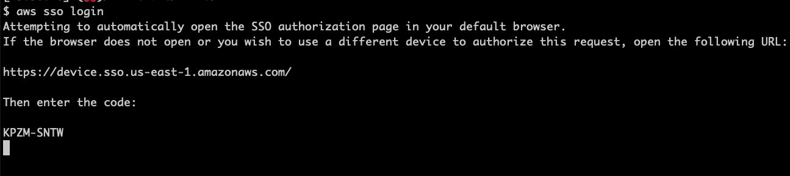
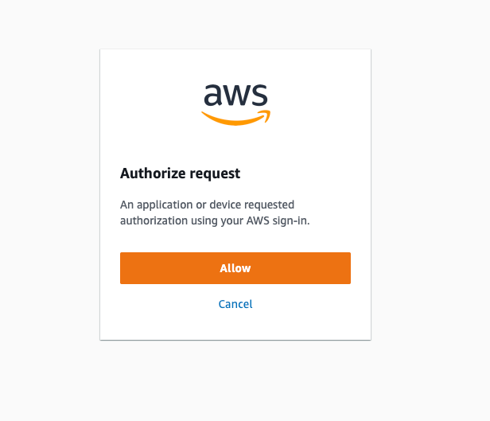

## auto-aws-sso-login

Every AWS SSO user knows the drill - you diligently go through your day trying to your best to
increase
shareholders value in your terminal, and suddenly out of the blue you get an uplifting message like:

```
SSOProviderInvalidToken: the SSO session has expired or is invalid
caused by: open /Users/gigi/.aws/sso/cache/85cc3da909953f9c5f8508452a2f72e7a5af08bb.json: 
no such file or directory
```

😱 Ahhhhhhh! What's going on?

Well, if you're an old hand at this game you know that your AWS SSO session has expired and you
just have to type:

```
aws sso login
```

Let me tell you something... whenever I hear "You just have to..." I know I'm in trouble. This is no
exception. Now, the horror begins... 👿 you are all of a sudden yanked from your cozy terminal into
the cold and unforgiving world of the browser. First, you are presented with a page like


You are expected to go back to your terminal and compare the code on the screen with the code
displayed in your terminal, then switch back to the browser and click the button:



I have a very high confidence that after doing that once ot twice, at least 100% of the people just
click the button without taking a second look at the code in their terminal. Clicking the button
just brings more misery in the form of another page (which takes a few seconds to load) and yet
another button to click.



OK. You know the drill by now, and you obediently click the button. This brings the very cheerful 
"Request approved" page with a nice green check mark ✅.


You may now switch back to your terminal and keep working. It will even display a nice message like:

```
Successfully logged into Start URL: https://d-1234567890.awsapps.com/start/
```

The entire ordeal probably took less that a minute, but it takes me out of my flow, which I really
dislike. When it happens every few hours day in and day out, it gets super annoying.

## 💡 The Solution

Enter `auto-web-login`, your new best friend. It will fully automate the process on your behalf.
You may remain safely ensconced in your terminal 🖥️, and just observe the browser madness of the AWS
SSO login workflow play out in front of you.

The solution is an amalgam of several tools:

- 🐒 A [Tampermonkey](https://www.tampermonkey.net/) user script clicks ze buttons for you!
- 🍏 A little AppleScript to put an end to that last page.
- 🚀 Launchd to make sure our AppleScript is always running.

Alright let's make it happen...

### Step 1: Install Tampermonkey 🐒

Go to [Tampermonkey.net](https://www.tampermonkey.net/) and follow the instructions to install the
browser extension.

### Step 2: Install the auto_web_login.js script 📜

With Tampermonkey installed, adding our script as a `auto-web-login` tampermonkey script is a
breeze:

- Copy the [auto_web_login.js](auto_web_login.js) user script
- Click on the Tampermonkey icon in your browser, and select “Create a new script...”
- Delete any content in the new script template.
- Paste the content of the clipboard and save the script (as `auto-web-login`).
- Save the script by clicking File > Save or pressing Cmd/Ctrl + S.
- Voilà! You're all set.

Step 3: Let's close that last tab 🍏

Guess what? modern paranoid browsers won't let a script close a window/tab it didn't open. Boooo 👎

Just kidding 🤡. If malicious scripts could close windows and tabs left and right (see what I did
there?) it could wreak havoc on the user experience.

Anyway, if we can't close the tab from inside the browser, let's close it from outside the browser.
I'm on a Mac, so I'll use AppleScript. This will require executing some Javascript against Chrome
from Applescript. In order to do that you need to tell Chrome it's fine to let AppleScript run some
Javascript. In the menu ber go to `View > Developer` and click `Allow JavaScript from Apple Events`

The code is here [CloseTabs.applescript](CloseTabs.applescript). The script checks if the active tab
of Chrome (change it if you use a different browser) shows the beloved/dreaded "Request authorized"
page and closes it. It keeps running forever, monitoring your browser and closing these tabs as
soon as it sees them. Whenever it closes a tab, it also does a solid for you and activates the
iTerm2 window, so you can keep doing what you love with no interruptions. How cool is that? 😎

We need this script running right from the get go. We can use Launchd to make sure it starts
whenever your computer starts and runs on your behalf (AKA Agent 😺). But, before we do that let's
compile our AppleScript:

```
$ osacompile -o CloseTabs.scpt CloseTabs.applescript
```

Alright. we got ou compiled script, and we have
Launched [auto_web_login.plist](auto_web_login.plist) file.
All we need to bring this masterpiece to a glorious end is to drop the file
into `~/Library/LaunchAgents` and load it

```
$ cp auto_web_login.plist ~/Library/LaunchAgents
$ launchctl load ~/Library/LaunchAgents/auto_web_login.plist
```

The End! Or is it?

## Bonus Tip!

Often you need to be logged in to AWS when running tests or starting local programs that need to
access AWS. Let's automate one last thing... the need to type `aws sso login`. What if any program
that needs AWS access could get it automatically even if currently you're logged out?

Well, it would be magical of course ✨. Keep reading and your fingers will never utter the
words`aws sso login` again...

Suppose you often need to run `some-program-that-needs-aws-access`, which apparently needs AWS
access. First, add the following incantation to your shell profile:

```
alias ensure-aws-sso='aws sts get-caller-identity > /dev/null 2>&1 || aws sso login'
```

It checks if you are logged in to AWS and if not runs `aws sso login` for you. Now, all you have to
do is stick `ensure-aws-sso` before any command that may require AWS access. For example, to run our
program we can create an alias with the super friendly:
name `alias sptnaa='ensure-aws-sso; some-program-that-needs-aws-access'`.

From now on when you want to run `some-program-that-needs-aws-access` you type the much shorter and
easy to remember `sptnaa` and you can rest assured that the program will start only once you're
logged in to AWS
weather or not you were logged in to AWS before.

The Real End! 🎉.
